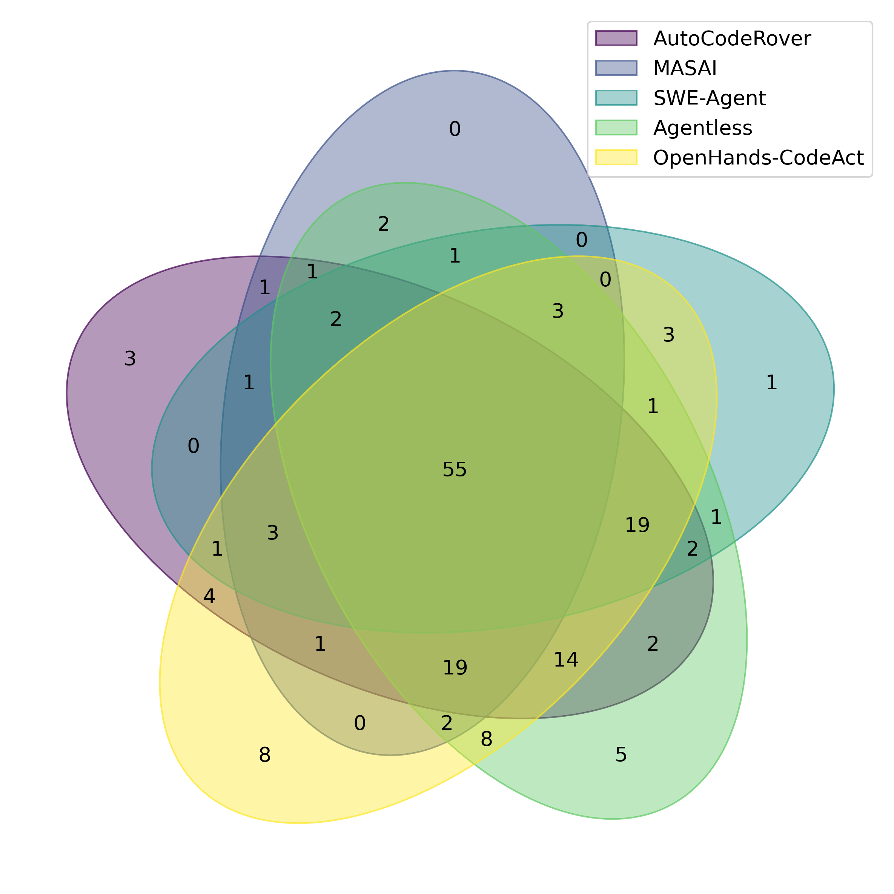
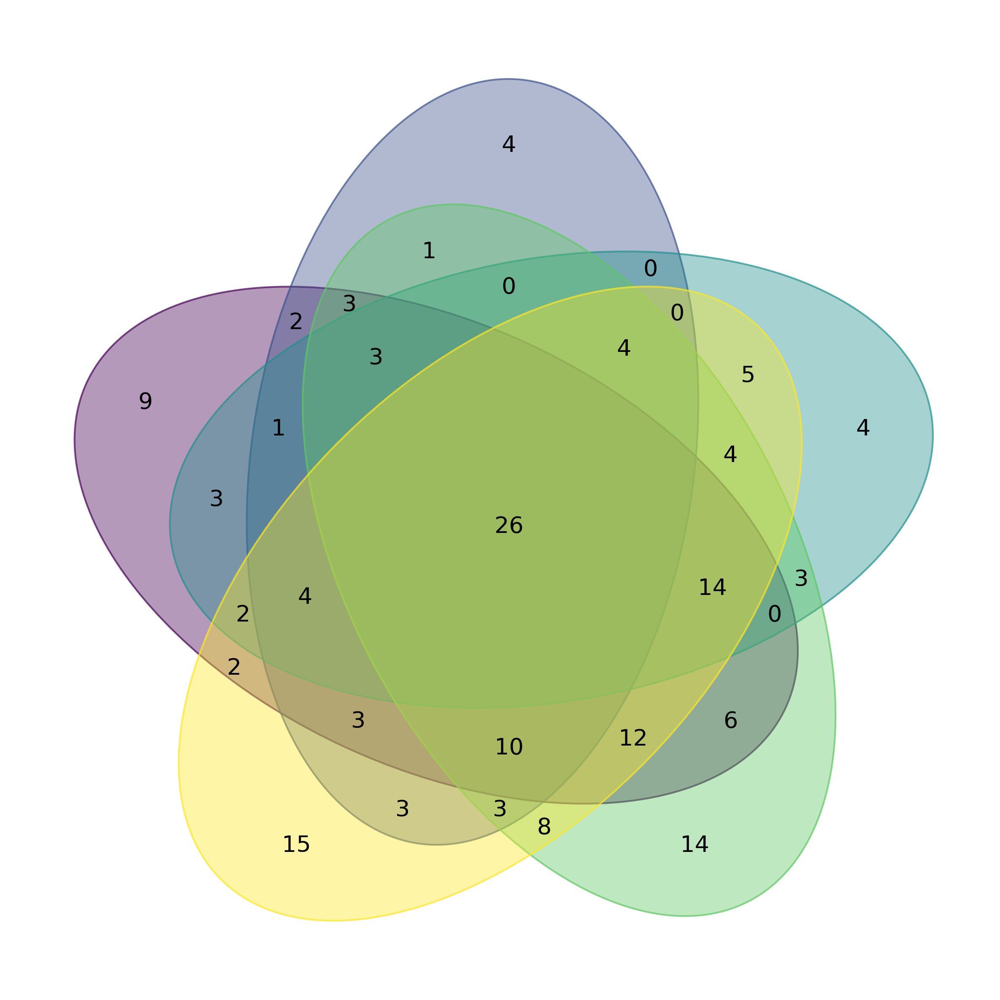
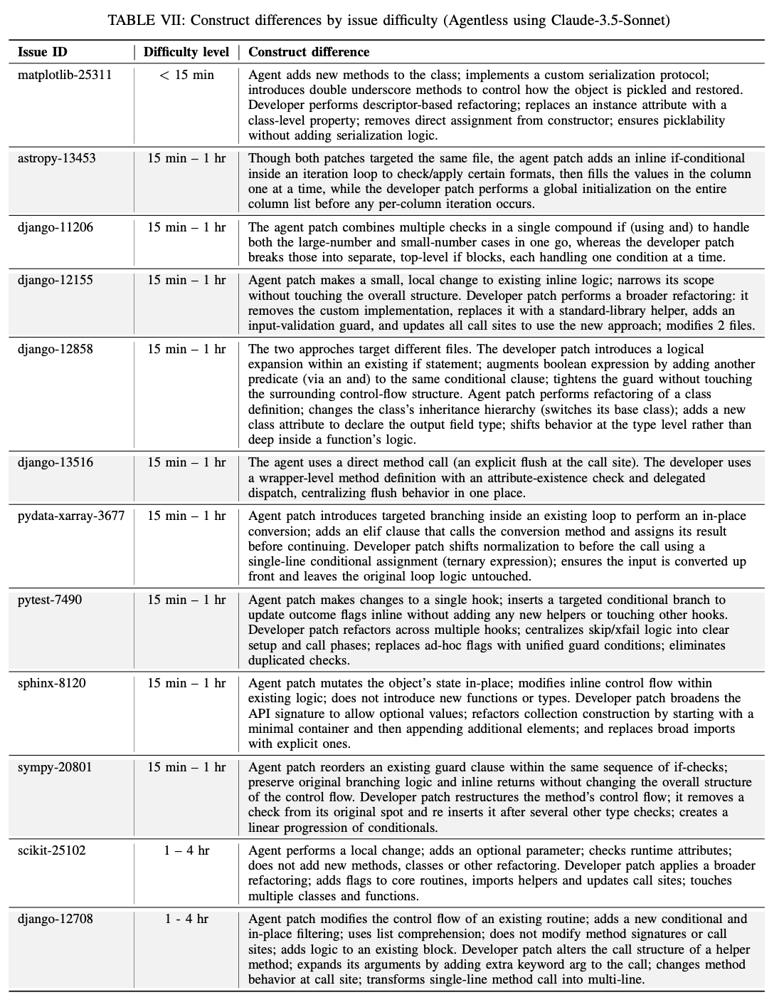
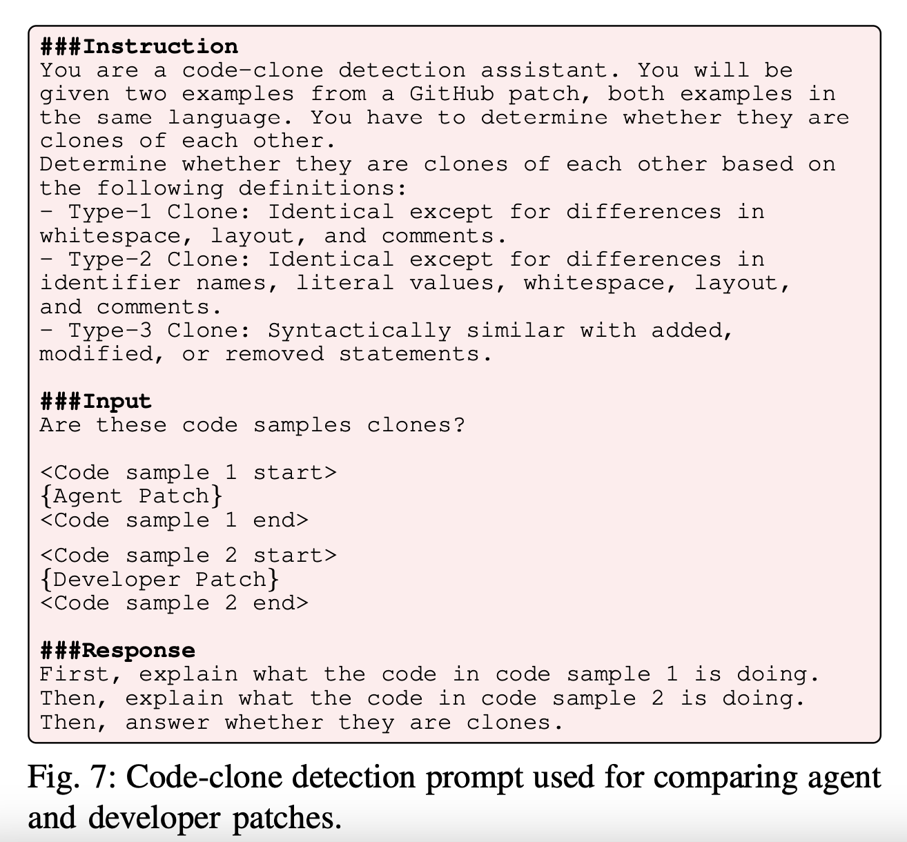

# Tracing-Agents

## :diamond_shape_with_a_dot_inside: Venn Diagram Breakdown: Agent Solving Abilities
These diagrams illustrate how different agents overlap in their ability to solve issues across human-annotated difficulty categories.
### :diamond_shape_with_a_dot_inside: Figure 1: Overall Agent Overlap

## :paperclip: Supplemental Material
Below are supplemental materials related to the results discussed in the main paper:
### :pencil2: Supplemental Material 1: Agent vs. Developer Construct Breakdown 

### :pencil2: Supplemental Material 2: Code Clone Detection Prompt
